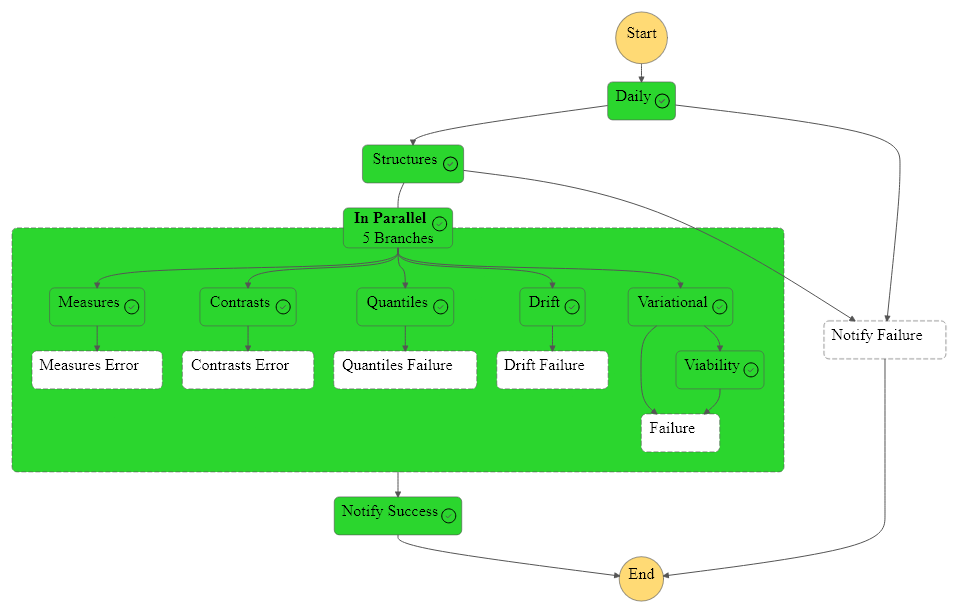

 

Infracstructure as Code

A limited publication.  Orchestrations via Step Functions control automatic daily deliveries of products.

 

### Periodic

This step functions orchestration runs a collection of container images twice a week; Monday & Friday.  The difference between this orchestration, and the one further below, is the _**variational**_ branch.  The _**variational**_ branch is the prediction branch; each time the model predicts [*t*](https://github.com/repatterning/configurations/blob/3e4479768e18b86c806123f37d5394d4f0489e1b/src/artefacts/architecture/variational/arguments.json#L10) hours ahead.

 
 

### Continuous

This orchestration runs everyday **except** Monday & Friday.

 
 

 
 

 
 

 
 
